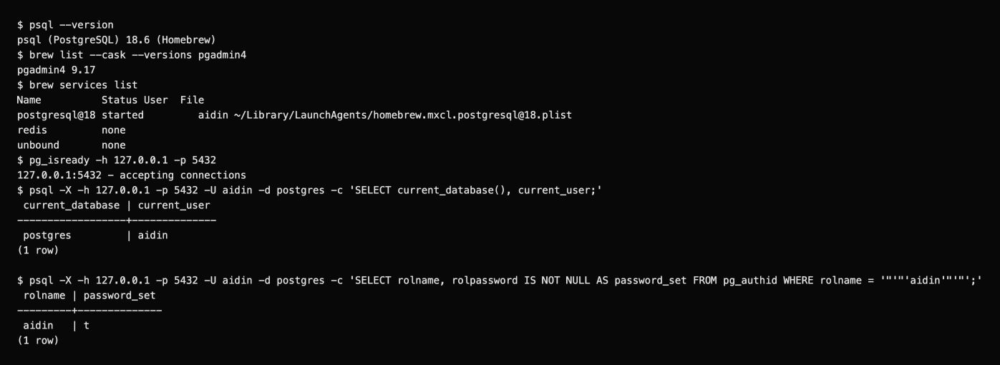
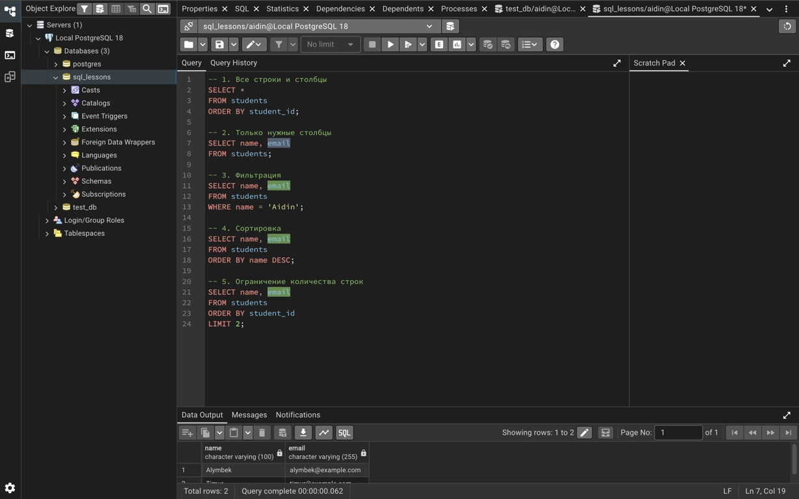

# Lab 2: Installing PostgreSQL and pgAdmin

I followed the macOS installation steps with Homebrew.

```bash
brew install postgresql@18
brew services start postgresql@18
brew install --cask pgadmin4
psql -U aidin -d postgres
```

| Setting | Value |
| --- | --- |
| System | macOS 15, Apple Silicon |
| PostgreSQL / pgAdmin | 18.6 / 4 version 9.17 |
| Host / port | `127.0.0.1` / `5432` |
| Database / role | `postgres` / `aidin` |

I set the role password with `ALTER USER aidin WITH PASSWORD '<local password>';`. The password is not stored here. The checks confirm `password_set = t`, a running service and a successful connection.



In pgAdmin, I registered `Local PostgreSQL 18` with the settings above. PostgreSQL runs the database; pgAdmin provides the graphical client.



[Recorded checks](outputs/setup-checks.txt) · [Course document](https://drive.google.com/file/d/1mHYboT9R0GPQhKh9muFf2Tv6AL_HQzws/view)
