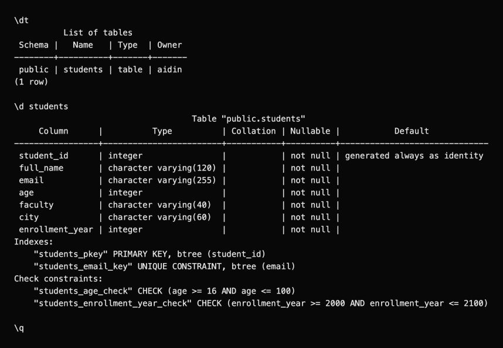
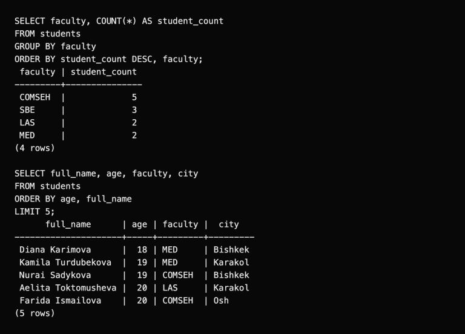
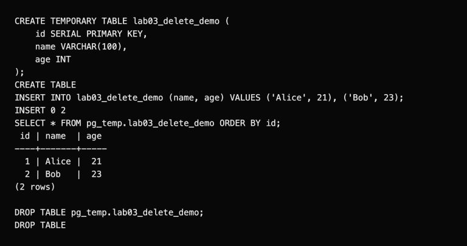

# Lab 3: Basic psql commands

I connected to `lab03`, created `students` with 12 fictional records, inspected its structure and ran the lesson's create, insert, select and drop example.

Run from the repository root:

```bash
psql -X -U aidin -d postgres -f lab-03/create-database.sql
psql -X -a -v ON_ERROR_STOP=1 -h 127.0.0.1 -p 5432 -U aidin -d lab03 -f lab-03/psql-demo.sql
```

`-h`, `-p`, `-U` and `-d` select the host, port, role and database. SQL ends with a semicolon; psql commands start with a backslash.

| Command | Purpose |
| --- | --- |
| `\l` | List databases |
| `\c lab03` | Switch database |
| `\dt` | List tables |
| `\d students` | Show columns and constraints |
| `\h SELECT` | Show SQL help |
| `\?` | Show psql help |
| `\q` | Exit |



The table has an identity primary key, unique emails and checks for age and enrollment year. Inserts use `ON CONFLICT (email) DO UPDATE`, so reruns keep 12 sample rows.



The disposable table contains Alice (21) and Bob (23). `DROP TABLE pg_temp.lab03_delete_demo` removes only that session's temporary table.



[SQL for pgAdmin](lab03.sql) · [Full session](outputs/psql-session.txt) · [Course document](https://drive.google.com/file/d/1jPfbRCXJYQPcMFPMhifz3LVRFjCeswUB/view)
