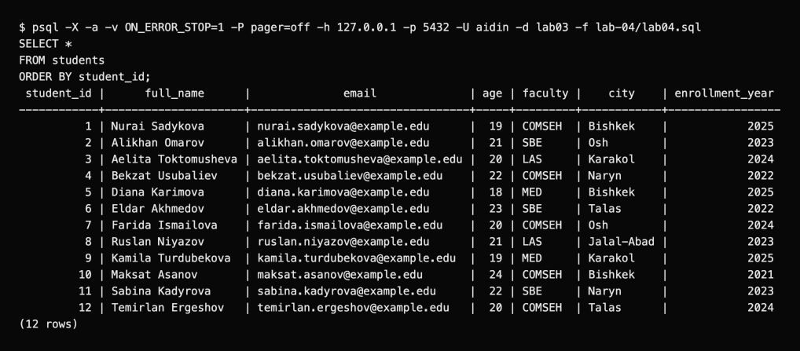
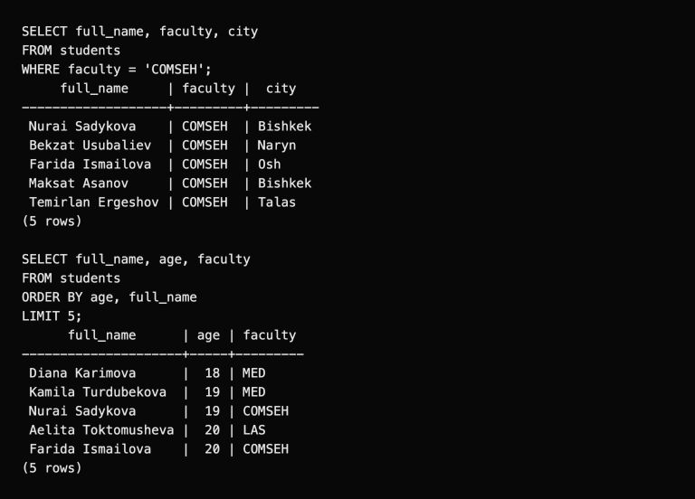

# Lab 4: First SQL query

I used the `students` table from Lab 3 to practice each part of the lesson. SQL keywords are case-insensitive; I write them in uppercase and use `snake_case` for identifiers. A result row is one record, and a result column is one selected field.

```bash
psql -X -a -v ON_ERROR_STOP=1 -h 127.0.0.1 -p 5432 -U aidin -d lab03 -f lab-04/lab04.sql
```

## Queries and results

| Query in [lab04.sql](lab04.sql) | What it shows | Rows |
| --- | --- | ---: |
| `SELECT *` | Every field, ordered by student ID | 12 |
| `SELECT full_name, email ... ORDER BY full_name ASC` | Selected fields in alphabetical order | 12 |
| `SELECT student_id, faculty` | Two fields from each record | 12 |
| `WHERE full_name = 'Nurai Sadykova'` | One matching name and email | 1 |
| `WHERE faculty = 'COMSEH'` | Students in one faculty | 5 |
| `ORDER BY full_name DESC` | Reverse alphabetical order | 12 |
| `ORDER BY student_id LIMIT 2` | The first two sample records | 2 |
| `ORDER BY age, full_name LIMIT 5` | The five youngest students, with names breaking age ties | 5 |

The course example `ORDER BY;` is incomplete. A column is required, for example:

```sql
SELECT full_name, email
FROM students
ORDER BY full_name ASC;
```

`ASC` is ascending and is the default; `DESC` reverses the order. Adding `ORDER BY` before `LIMIT` makes the choice of rows predictable when the sort keys distinguish them.

The script uses both `--` line comments and `/* ... */` block comments. PostgreSQL ignores them when executing the queries.





The [full output](outputs/psql-session.txt) contains all eight queries. I can choose columns, filter rows, sort results and return a limited number of records.

[Course document](https://drive.google.com/file/d/10qSdz8lve4SAzF0mLsQW1yG2oGQPK1aX/view)
