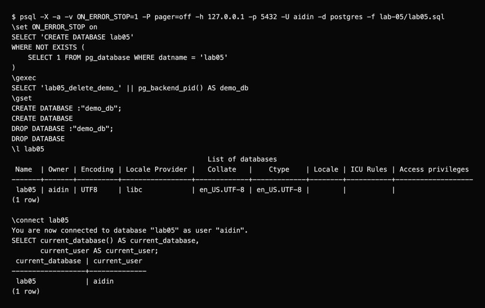

# Lab 5: Databases

I created `lab05`, listed it with `\l lab05`, switched with `\c lab05` and checked `current_database()` and `current_user`.

```bash
psql -X -a -v ON_ERROR_STOP=1 -U aidin -d postgres -f lab-05/lab05.sql
```

The script also creates and drops its own `lab05_delete_demo_<PID>` database. It stops if creation fails. Reruns keep `lab05` and remove only the disposable database.

`DROP DATABASE` removes the database and its data. It runs from another database, outside a transaction, with no other sessions connected to the target. `\c` switches connections directly; no separate disconnect is needed.

Names use lowercase and underscores, for example `student_records`, without spaces or reserved SQL words.



[SQL](lab05.sql) · [Full session](outputs/psql-session.txt) · [Course document](https://drive.google.com/file/d/1tACFw9v3Um6sak1ZjbQzxRur91qSvJKw/view)
