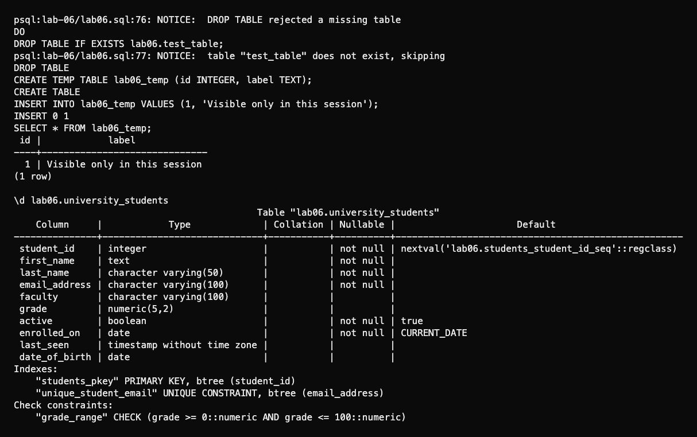

# Lab 6: Tables, data types and constraints

I created two student records and used `ALTER TABLE` to add and drop columns, change a type, add named constraints and rename a column and the table.

```bash
psql -X -a -v ON_ERROR_STOP=1 -U aidin -d postgres -f lab-06/psql-demo.sql
```

| Topic | Result |
| --- | --- |
| Types | `SERIAL`, `VARCHAR`, `TEXT`, `NUMERIC`, `BOOLEAN`, `DATE`, `TIMESTAMP` |
| Constraints | Duplicate email, grade above 100 and `NULL` first name rejected |
| `DROP TABLE` | Disposable table removed; missing table rejected; `IF EXISTS` skipped it |
| Temporary table | One row visible during the session; table removed when the session ended |

`INTEGER` stores whole numbers; `BIGINT` has a larger range. Names use lowercase and underscores. Primary keys identify rows; [Lab 8](../lab-08/README.md) demonstrates foreign keys. The grade check allows `NULL` because grade is optional.




Rerunning resets the example tables in `lab06`.

[SQL](lab06.sql) · [Full session](outputs/psql-session.txt) · [Course document](https://drive.google.com/file/d/1VbzMZLRlmZaGdtf2FBgx3tjAhQRSBaNU/view)
