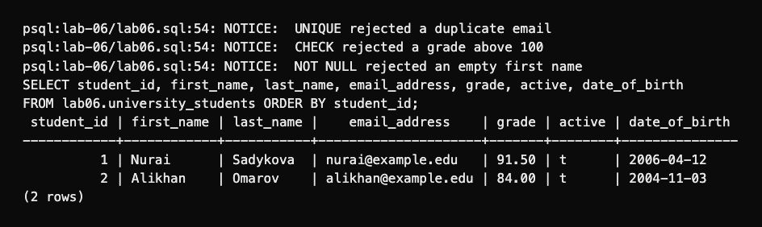

# Lab 6: Tables, data types and constraints

I created a student table in the `lab06` schema, inserted two rows, then changed the table with `ALTER TABLE`. The script adds and removes columns, changes `first_name` to `TEXT`, adds a grade check, and renames both a column and the table. It also creates and drops a disposable table and a session-only temporary table.

Run from the repository root:

```bash
psql -X -a -v ON_ERROR_STOP=1 -U aidin -d postgres -f lab-06/psql-demo.sql
```

The script catches three expected errors to show that `UNIQUE`, `CHECK`, and `NOT NULL` reject invalid rows. The final table still contains two students. `\d` shows the primary key, unique email, and grade check.



Only example tables in the `lab06` schema are reset on a rerun. The temporary table is removed at the end of the session.

[Full session](outputs/psql-session.txt) · [Course document](https://drive.google.com/file/d/1VbzMZLRlmZaGdtf2FBgx3tjAhQRSBaNU/view)
