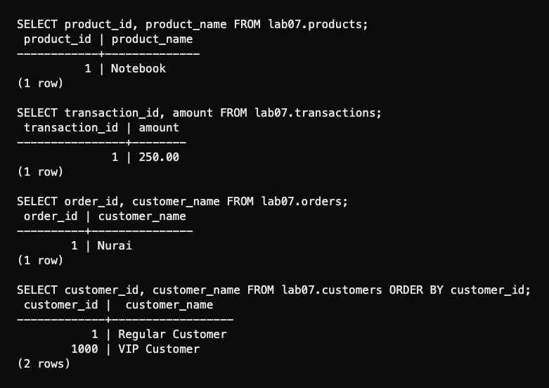

# Lab 7: Primary keys

I defined primary keys inline, at table level, with a constraint name and with `ALTER TABLE`. A table has one primary key, which may contain several columns. Keys identify rows for references and updates and should remain stable.

```bash
psql -X -a -v ON_ERROR_STOP=1 -U aidin -d postgres -f lab-07/psql-demo.sql
```

The composite key `(student_id, course_id, semester)` allows the same course in different semesters and rejects a duplicate enrollment. Primary keys reject `NULL` and duplicate values. `\d` and `pg_indexes` show their unique B-tree indexes.


`SERIAL`, `BIGSERIAL` and `IDENTITY` generate IDs from sequences. `ALWAYS` rejects an explicit ID unless `OVERRIDING SYSTEM VALUE` is used; `BY DEFAULT` accepts one. `IDENTITY` alone does not guarantee uniqueness, so these tables also use `PRIMARY KEY`.



Rerunning resets only `lab07`.

[SQL](lab07.sql) · [Full session](outputs/psql-session.txt) · [Course document](https://drive.google.com/file/d/1dDxnTfpofoXS5KFv2CgsM0r8ZP03imXZ/view) · [Identity reference](https://www.postgresql.org/docs/18/ddl-identity-columns.html)
