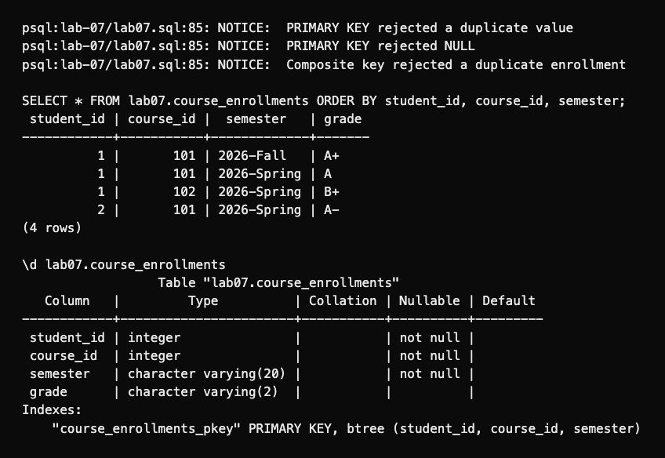

# Lab 7: Primary keys

I tried four ways to define a single-column primary key: inline, at table level, with a name, and with `ALTER TABLE`. A separate enrollment table uses `(student_id, course_id, semester)` as one composite key. The same student and course can appear in two semesters, but a duplicate semester is rejected.

Run from the repository root:

```bash
psql -X -a -v ON_ERROR_STOP=1 -U aidin -d postgres -f lab-07/psql-demo.sql
```

The script also creates `SERIAL`, `BIGSERIAL`, `GENERATED ALWAYS`, and `GENERATED BY DEFAULT` IDs. The first three generate IDs when omitted. `BY DEFAULT` also accepts an explicit ID. Two caught errors show that a primary key rejects duplicates and `NULL`. `\d` and `pg_indexes` show the unique indexes PostgreSQL created.



Rerunning resets only the `lab07` schema.

[Full session](outputs/psql-session.txt) · [Course document](https://drive.google.com/file/d/1dDxnTfpofoXS5KFv2CgsM0r8ZP03imXZ/view)
