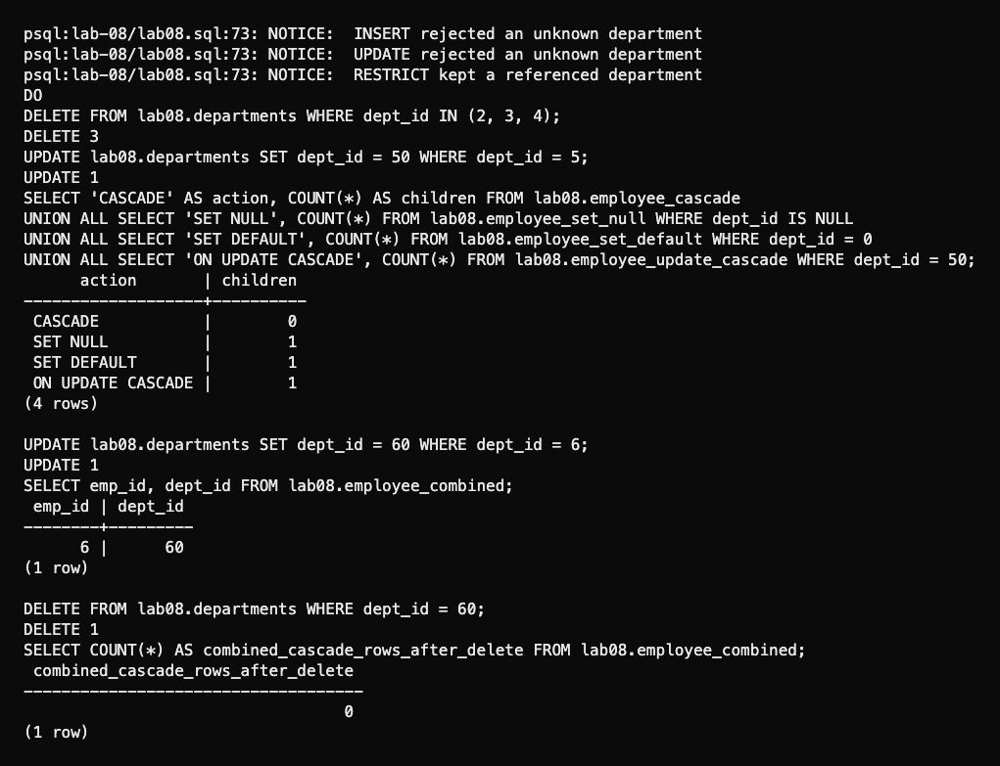
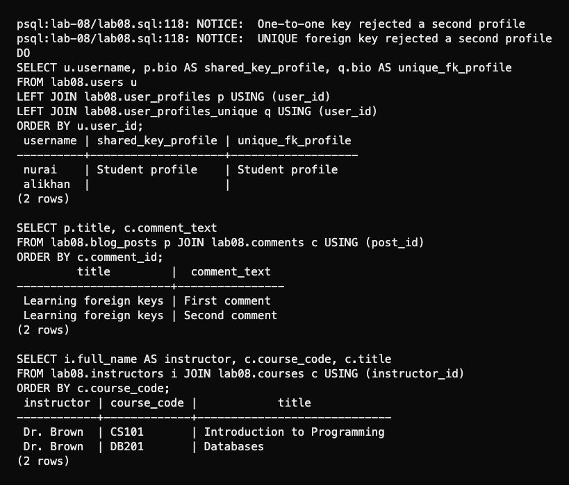
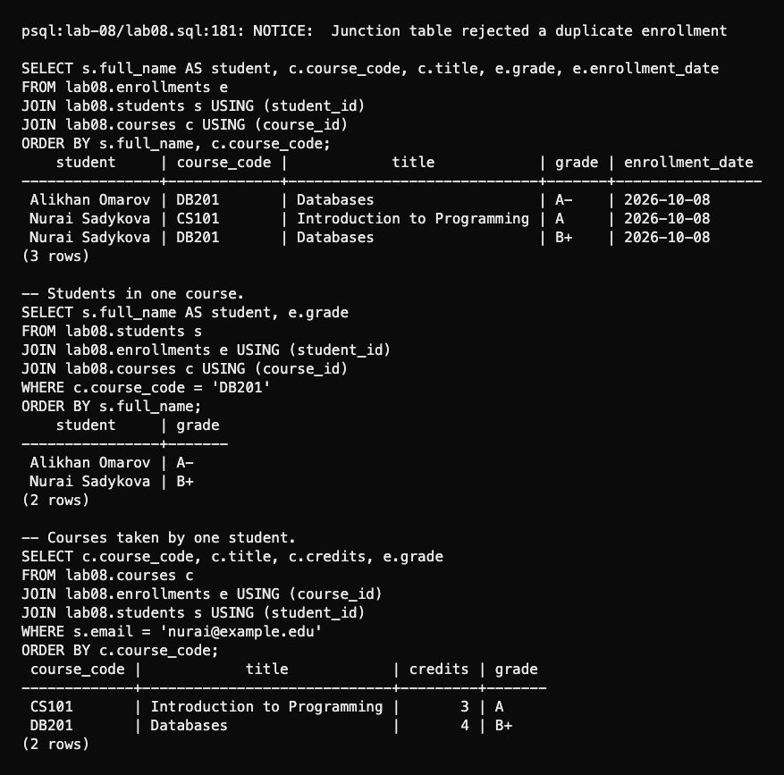

# Lab 8: Foreign keys and relationships

I defined foreign keys inline, at table level, with a name and with `ALTER TABLE`. Invalid parent IDs fail on insert and update.

```bash
psql -X -a -v ON_ERROR_STOP=1 -U aidin -d postgres -f lab-08/psql-demo.sql
```

| Rule | Verified result |
| --- | --- |
| `ON DELETE RESTRICT` | Referenced department kept |
| `ON DELETE CASCADE` | Child row deleted |
| `ON DELETE SET NULL` | Child kept with a null department |
| `ON DELETE SET DEFAULT` | Child points to existing department 0 |
| `ON UPDATE CASCADE` | Child follows the changed parent ID |
| Combined update/delete cascade | Child follows ID 60, then disappears after parent deletion |

PostgreSQL's default action is `NO ACTION`; this lab explicitly uses `RESTRICT`. `SET DEFAULT` still requires a valid parent.



Both 1:1 designs work: a shared primary key and a separate `UNIQUE NOT NULL` foreign key. Each rejects a second profile. A user may still have no profile. For 1:N, one instructor has two courses and one post has two comments.



The N:M enrollment table has two foreign keys and a composite primary key. Three enrollments remain after rejecting a duplicate. The queries list all enrollments, both students in `DB201` and both courses taken by Nurai.



Rerunning resets only `lab08`.

[SQL](lab08.sql) · [Full session](outputs/psql-session.txt) · [Course document](https://drive.google.com/file/d/1HLQfBeDeBlFqEo0Z8jtA9E8YW-AmAQfw/view) · [Foreign key reference](https://www.postgresql.org/docs/18/ddl-constraints.html#DDL-CONSTRAINTS-FK)
